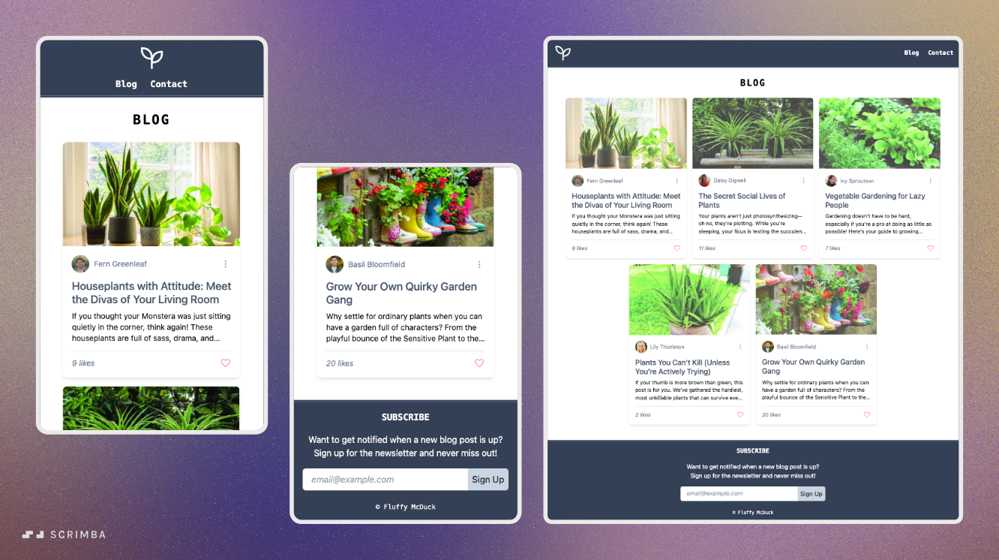

# 🌱 Plant Enthusiasts Blog  

Projekt stworzony w celu nauki **Tailwind CSS** poprzez praktyczne ćwiczenie i wdrożenie jego klas w rzeczywistej aplikacji. Blog skierowany jest do pasjonatów roślin i prezentuje przykładowe treści w formie artykułów, nagłówków, układów stron i komponentów.

## 🎯 Cel projektu  
- Poznanie i wdrożenie klas Tailwind CSS  
- Ćwiczenie responsywności i layoutów z użyciem Flexboxa i Grid  
- Zbudowanie kompletnej strony z nagłówkiem, stopką, artykułami oraz elementami typografii  
- Wdrożenie praktycznego projektu blogowego jako podsumowanie nauki  

## 🛠️ Technologie  
- **HTML5**  
- **Tailwind CSS**  

## 📚 Zakres nauki 
Projekt obejmuje zastosowanie następujących zagadnień Tailwind CSS:  
- 🔹 **Element sizing** (rozmiary, wymiary)  
- 🔹 **Kolory** (tła, teksty, przyciski)  
- 🔹 **Spacing** (padding, margin)  
- 🔹 **Header & Footer**  
- 🔹 **Typografia** (font classes, text classes, inne klasy typograficzne)  
- 🔹 **Display & Position**  
- 🔹 **Flexbox**  
- 🔹 **Borders i Layout**  
- 🔹 **Common utilities**  
- 🔹 **Modifiers** (hover, focus, active)  
- 🔹 **Responsive design**  
- 🔹 **Extra styling i desktop layout**  

## 🚀 Funkcjonalności bloga  
- Strona główna z nagłówkiem i stopką  
- Lista artykułów o roślinach  
- Podstawowe elementy typografii (nagłówki, akapity, cytaty)  
- Układ mobilny i desktopowy (responsive)  
- Zastosowanie modifierów (hover, active) do interakcji  

## 🌍 Demo  
🔗 [Zobacz projekt na GitHub Pages](https://marwoz01.github.io/plant-enthusiasts-blog/)  

## 📸 Podgląd projektu  
  
